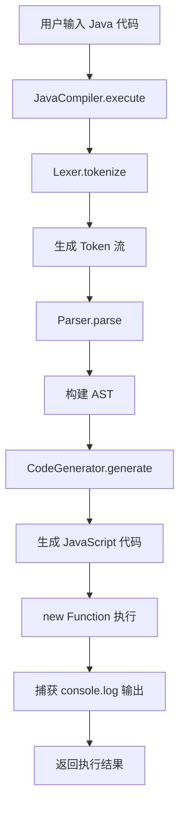
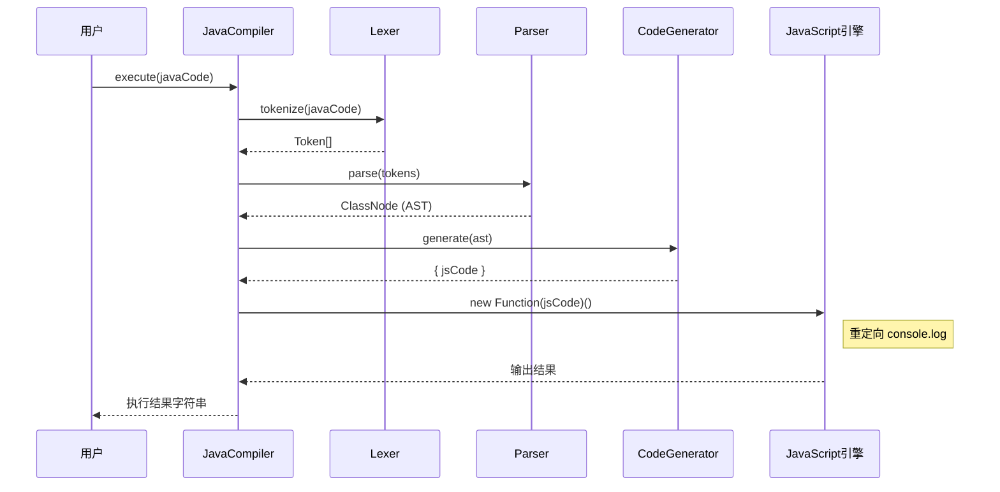
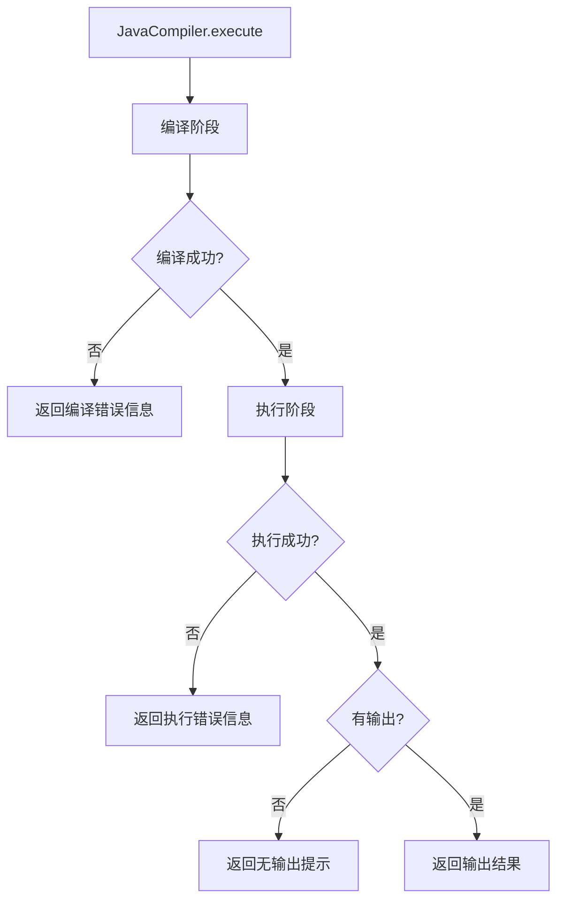

# JavaCompiler 组件详细设计文档

## 1. 需求分析

### 1.1 业务背景
根据业务/产品描述，需要实现一个 Java 编译器，将 Java 代码转换为 JavaScript 代码并执行，返回输出结果。该编译器将集成到 DayDetail.vue 组件中，用于在线 Java 代码运行功能。

### 1.2 功能需求

| 需求编号 | 需求描述 | 来源 |
| :--- | :--- | :--- |
| REQ-001 | 支持 Java 源代码的词法分析（Tokenization） | "用js设计一个简单的java编译器" |
| REQ-002 | 支持 Java 源代码的语法分析（AST构建） | "用js设计一个简单的java编译器" |
| REQ-003 | 支持将 Java AST 转换为 JavaScript 代码 | "将java代码转成js执行" |
| REQ-004 | 支持 Java 代码的执行并返回输出结果 | "返回输出结果" |
| REQ-005 | 支持 `System.out.println()` 输出语句 | 常见 Java 输出方式 |
| REQ-006 | 支持变量声明和赋值 | 基础 Java 语法 |
| REQ-007 | 支持条件语句（if-else） | 基础 Java 语法 |
| REQ-008 | 支持循环语句（while、for） | 基础 Java 语法 |

### 1.3 输入输出规格

| 类型 | 格式 | 示例 |
| :--- | :--- | :--- |
| 输入 | Java 源代码字符串 | `public class Test { public static void main(String[] args) { System.out.println("Hello"); } }` |
| 输出 | 执行结果字符串 | `Hello\n\n程序执行成功！` |

---

## 2. 总体架构设计

### 2.1 架构风格
采用经典的编译器架构，分为词法分析、语法分析、代码生成三个主要阶段。

### 2.2 模块划分

| 模块 | 职责 | 对应类 |
| :--- | :--- | :--- |
| Lexer（词法分析器） | 将源代码分解为 Token 流 | `Lexer` |
| Parser（语法分析器） | 根据 Token 流构建 AST | `Parser` |
| CodeGenerator（代码生成器） | 将 AST 转换为 JavaScript 代码 | `CodeGenerator` |
| JavaCompiler（编译器入口） | 提供统一的编译和执行接口 | `JavaCompiler` |

### 2.3 核心流程图



---

## 3. 详细设计

### 3.1 类结构设计

#### 3.1.1 TokenType 枚举

| 枚举值 | 说明 | 匹配模式 |
| :--- | :--- | :--- |
| `CLASS` | class 关键字 | `class` |
| `PUBLIC` | public 关键字 | `public` |
| `STATIC` | static 关键字 | `static` |
| `VOID` | void 关键字 | `void` |
| `INT` | int 类型 | `int` |
| `STRING` | String 类型 | `String` |
| `BOOLEAN` | boolean 类型 | `boolean` |
| `DOUBLE` | double 类型 | `double` |
| `FLOAT` | float 类型 | `float` |
| `LONG` | long 类型 | `long` |
| `CHAR` | char 类型 | `char` |
| `IF` | if 关键字 | `if` |
| `ELSE` | else 关键字 | `else` |
| `WHILE` | while 关键字 | `while` |
| `FOR` | for 关键字 | `for` |
| `RETURN` | return 关键字 | `return` |
| `FINAL` | final 关键字 | `final` |
| `IDENTIFIER` | 标识符 | `[a-zA-Z_][a-zA-Z0-9_]*` |
| `INTEGER_LITERAL` | 整数字面量 | `[0-9]+` |
| `STRING_LITERAL` | 字符串字面量 | `"[^"]*"` |
| `BOOLEAN_LITERAL` | 布尔字面量 | `true\|false` |
| `ASSIGN` | 赋值运算符 | `=` |
| `PLUS` | 加法运算符 | `+` |
| `MINUS` | 减法运算符 | `-` |
| `MULTIPLY` | 乘法运算符 | `*` |
| `DIVIDE` | 除法运算符 | `/` |
| `MOD` | 取模运算符 | `%` |
| `AND` | 逻辑与 | `&&` |
| `OR` | 逻辑或 | `\|\|` |
| `NOT` | 逻辑非 | `!` |
| `EQUAL` | 等于比较 | `==` |
| `NOT_EQUAL` | 不等于比较 | `!=` |
| `LESS_THAN` | 小于比较 | `<` |
| `GREATER_THAN` | 大于比较 | `>` |
| `LESS_EQUAL` | 小于等于比较 | `<=` |
| `GREATER_EQUAL` | 大于等于比较 | `>=` |
| `PLUS_PLUS` | 自增运算符 | `++` |
| `MINUS_MINUS` | 自减运算符 | `--` |
| `LPAREN` | 左括号 | `(` |
| `RPAREN` | 右括号 | `)` |
| `LBRACE` | 左花括号 | `{` |
| `RBRACE` | 右花括号 | `}` |
| `LBRACKET` | 左方括号 | `[` |
| `RBRACKET` | 右方括号 | `]` |
| `SEMICOLON` | 分号 | `;` |
| `COMMA` | 逗号 | `,` |
| `DOT` | 点号 | `.` |
| `EOF` | 文件结束 | - |

#### 3.1.2 Token 接口

| 字段 | 类型 | 说明 |
| :--- | :--- | :--- |
| `type` | `TokenType` | Token 类型 |
| `value` | `string` | Token 值 |
| `line` | `number` | 行号 |
| `column` | `number` | 列号 |

#### 3.1.3 AST 节点类型

| 节点类型 | 说明 | 关键字段 |
| :--- | :--- | :--- |
| `ClassNode` | 类节点 | `name`, `methods` |
| `MethodNode` | 方法节点 | `name`, `parameters`, `body` |
| `VariableDeclNode` | 变量声明节点 | `typeName`, `name`, `value`, `isFinal` |
| `AssignmentNode` | 赋值节点 | `name`, `value` |
| `ExpressionNode` | 表达式节点 | `type`, `left`, `right`, `operator`, `value`, `name`, `args` |
| `IfNode` | if 语句节点 | `condition`, `thenBranch`, `elseBranch` |
| `WhileNode` | while 循环节点 | `condition`, `body` |
| `ForNode` | for 循环节点 | `init`, `condition`, `update`, `body` |
| `PrintNode` | 打印节点 | `expression` |
| `ReturnNode` | 返回节点 | `value` |

### 3.2 关键类设计

#### 3.2.1 Lexer 类

**职责**：将 Java 源代码字符串分解为 Token 序列。

**核心方法**：

| 方法名 | 功能说明 | 参数 | 返回值 |
| :--- | :--- | :--- | :--- |
| `constructor` | 初始化词法分析器 | `source: string` | - |
| `tokenize` | 执行词法分析，返回 Token 数组 | - | `Token[]` |
| `nextToken` | 获取下一个 Token | - | `Token` |
| `advance` | 前进到下一个字符 | - | `void` |
| `skipWhitespace` | 跳过空白字符 | - | `void` |
| `readIdentifier` | 读取标识符 | - | `string` |
| `readNumber` | 读取数字 | - | `string` |
| `readString` | 读取字符串 | - | `string` |

**状态字段**：

| 字段名 | 类型 | 说明 |
| :--- | :--- | :--- |
| `source` | `string` | 源代码 |
| `position` | `number` | 当前位置 |
| `currentChar` | `string` | 当前字符 |
| `line` | `number` | 当前行号 |
| `column` | `number` | 当前列号 |

#### 3.2.2 Parser 类

**职责**：根据 Token 流构建抽象语法树（AST）。

**核心方法**：

| 方法名 | 功能说明 | 参数 | 返回值 |
| :--- | :--- | :--- | :--- |
| `constructor` | 初始化语法分析器 | `tokens: Token[]` | - |
| `parse` | 执行语法分析，返回 AST | - | `ClassNode` |
| `parseClass` | 解析类声明 | - | `ClassNode` |
| `parseMethod` | 解析方法声明 | - | `MethodNode` |
| `parseStatement` | 解析语句 | - | `StatementNode` |
| `parseExpression` | 解析表达式 | - | `ExpressionNode` |
| `parseIf` | 解析 if 语句 | - | `IfNode` |
| `parseWhile` | 解析 while 循环 | - | `WhileNode` |
| `parseFor` | 解析 for 循环 | - | `ForNode` |
| `parseVariableDecl` | 解析变量声明 | - | `VariableDeclNode` |
| `parseAssignment` | 解析赋值语句 | - | `AssignmentNode` |
| `eat` | 消费指定类型的 Token | `type: TokenType` | `Token` |
| `advance` | 前进到下一个 Token | - | `void` |
| `peek` | 查看下一个 Token | - | `Token` |

**表达式解析优先级**（从低到高）：

```
1. 逻辑或 (||)
2. 逻辑与 (&&)
3. 相等比较 (==, !=)
4. 关系比较 (<, >, <=, >=)
5. 加减运算 (+, -)
6. 乘除模运算 (*, /, %)
7. 一元运算 (!, -)
8. 基本表达式 (标识符、字面量、括号表达式)
```

#### 3.2.3 CodeGenerator 类

**职责**：将 AST 转换为 JavaScript 代码。

**核心方法**：

| 方法名 | 功能说明 | 参数 | 返回值 |
| :--- | :--- | :--- | :--- |
| `constructor` | 初始化代码生成器 | - | - |
| `generate` | 生成 JavaScript 代码 | `ast: ClassNode` | `{ jsCode: string }` |
| `visitClass` | 访问类节点 | `node: ClassNode` | `void` |
| `visitMethod` | 访问方法节点 | `node: MethodNode` | `void` |
| `visitStatement` | 访问语句节点 | `node: StatementNode` | `void` |
| `visitExpression` | 访问表达式节点 | `node: ExpressionNode` | `void` |
| `generateExpression` | 生成表达式的 JavaScript 代码 | `node: ExpressionNode` | `string` |
| `write` | 写入一行代码 | `line: string` | `void` |

**Java 到 JavaScript 映射规则**：

| Java 特性 | JavaScript 转换 |
| :--- | :--- |
| `public static void main()` | 直接执行方法体 |
| `System.out.println()` | `console.log()` |
| `int/long/float/double` | `let/const` |
| `String` | `let/const` |
| `boolean` | `let/const` |
| `final` | `const` |
| `if-else` | `if-else` |
| `while` | `while` |
| `for` | `for` |

#### 3.2.4 JavaCompiler 类

**职责**：提供统一的编译和执行入口。

**核心方法**：

| 方法名 | 功能说明 | 参数 | 返回值 |
| :--- | :--- | :--- | :--- |
| `compile` | 编译 Java 代码为 JavaScript | `javaCode: string` | `{ jsCode: string; error?: string }` |
| `execute` | 编译并执行 Java 代码，返回输出 | `javaCode: string` | `string` |

**执行流程**：



---

## 4. 接口设计

### 4.1 对外暴露的接口

| 接口 | 方法 | 参数 | 返回值 | 说明 |
| :--- | :--- | :--- | :--- | :--- |
| `JavaCompiler` | `compile` | `javaCode: string` | `{ jsCode: string; error?: string }` | 编译 Java 代码 |
| `JavaCompiler` | `execute` | `javaCode: string` | `string` | 编译并执行 |

### 4.2 DayDetail.vue 集成示例

```typescript
import { JavaCompiler } from '@/compiler/JavaCompiler';

const runCode = () => {
  codeExecuting.value = true;
  setTimeout(() => {
    try {
      const output = JavaCompiler.execute(javaContent.value);
      codeOutput.value = output;
    } catch (error) {
      codeOutput.value = `执行错误: ${error instanceof Error ? error.message : String(error)}`;
    }
    codeExecuting.value = false;
  }, 800);
};
```

---

## 5. 数据结构设计

### 5.1 AST 节点类图

```mermaid
classDiagram
    class ASTNode {
        <<interface>>
    }
    
    class ClassNode {
        +string name
        +MethodNode[] methods
    }
    
    class MethodNode {
        +string name
        +{type:string, name:string}[] parameters
        +StatementNode[] body
    }
    
    class VariableDeclNode {
        +string typeName
        +string name
        +ExpressionNode value
        +boolean isFinal
    }
    
    class AssignmentNode {
        +string name
        +ExpressionNode value
    }
    
    class ExpressionNode {
        +string type
        +ExpressionNode left
        +ExpressionNode right
        +string operator
        +string value
        +string name
        +ExpressionNode[] args
    }
    
    class IfNode {
        +ExpressionNode condition
        +StatementNode[] thenBranch
        +StatementNode[] elseBranch
    }
    
    class WhileNode {
        +ExpressionNode condition
        +StatementNode[] body
    }
    
    class ForNode {
        +VariableDeclNode|AssignmentNode init
        +ExpressionNode condition
        +ExpressionNode update
        +StatementNode[] body
    }
    
    class PrintNode {
        +ExpressionNode expression
    }
    
    class ReturnNode {
        +ExpressionNode value
    }
    
    ASTNode <|-- ClassNode
    ASTNode <|-- MethodNode
    ASTNode <|-- VariableDeclNode
    ASTNode <|-- AssignmentNode
    ASTNode <|-- ExpressionNode
    ASTNode <|-- IfNode
    ASTNode <|-- WhileNode
    ASTNode <|-- ForNode
    ASTNode <|-- PrintNode
    ASTNode <|-- ReturnNode
```

---

## 6. 错误处理设计

### 6.1 错误类型

| 错误类型 | 触发条件 | 错误消息格式 |
| :--- | :--- | :--- |
| **词法错误** | 遇到无法识别的字符 | `未知字符: {char} 在第 {line} 行, 第 {column} 列` |
| **语法错误** | Token 顺序不符合语法规则 | `期望 {expected}，但得到 {actual} 在第 {line} 行` |
| **表达式错误** | 遇到无法解析的表达式类型 | `未知的表达式类型: {type}` |
| **执行错误** | JavaScript 运行时异常 | `执行错误: {message}` |

### 6.2 错误处理流程



---

## 7. 部署与集成方案

### 7.1 文件结构

```
src/
├── compiler/
│   └── JavaCompiler.ts    # 编译器核心实现
├── pages/
│   └── DayDetail.vue      # 集成编译器的页面组件
└── ...
```

### 7.2 依赖关系

| 依赖 | 说明 |
| :--- | :--- |
| TypeScript | 类型支持 |
| Vue 3 | 前端框架 |

---

## 8. 代码安全性

### 8.1 注意事项

| 风险点 | 说明 |
| :--- | :--- |
| **代码注入** | 用户输入的 Java 代码可能包含恶意代码 |
| **无限循环** | 恶意代码可能导致浏览器卡死 |
| **资源消耗** | 复杂代码可能消耗大量 CPU 和内存 |

### 8.2 安全措施

| 措施 | 说明 |
| :--- | :--- |
| **代码审查** | 对生成的 JavaScript 代码进行静态分析 |
| **执行超时** | 考虑添加执行时间限制（当前未实现） |
| **沙箱环境** | 使用 `new Function` 隔离执行环境 |
| **输出限制** | 限制输出内容大小（当前未实现） |

---

## 9. 测试建议

### 9.1 测试用例覆盖

| 测试类别 | 测试内容 | 示例代码 |
| :--- | :--- | :--- |
| **基本输出** | System.out.println | `System.out.println("Hello");` |
| **变量声明** | 各种类型变量 | `int x = 10;` |
| **赋值语句** | 变量赋值 | `x = x + 5;` |
| **条件语句** | if-else | `if (x > 5) { ... } else { ... }` |
| **while 循环** | 基本循环 | `while (i < 5) { ... }` |
| **for 循环** | 基本循环 | `for (int i=0; i<5; i++) { ... }` |
| **表达式** | 算术运算 | `a + b * c` |
| **空语句** | 单独分号 | `;` |
| **点表达式** | System.out.println | 完整调用 |

### 9.2 边界测试

| 测试场景 | 说明 |
| :--- | :--- |
| 空代码 | 输入为空字符串 |
| 语法错误 | 缺少分号、括号不匹配等 |
| 运行时错误 | 变量未定义、除零错误等 |
| 复杂嵌套 | 多层嵌套的 if-else 和循环 |

---

## 附录：支持的 Java 语法清单

### 完整支持

- 类声明：`public class Name { ... }`
- 主方法：`public static void main(String[] args) { ... }`
- 变量声明：`int x`, `String s`, `boolean flag` 等
- 赋值语句：`x = 10`, `s = "hello"`
- 条件语句：`if-else`
- 循环语句：`while`, `for`
- 输出语句：`System.out.println()`
- 算术运算：`+`, `-`, `*`, `/`, `%`
- 比较运算：`==`, `!=`, `<`, `>`, `<=`, `>=`
- 逻辑运算：`&&`, `\|\|`, `!`
- 自增自减：`++`, `--`

### 部分支持

- 方法调用（仅支持 `System.out.println`）

### 暂不支持

- 自定义方法（除 main 外）
- 对象和类实例化
- 数组操作
- 异常处理
- 泛型
- 包和导入语句
